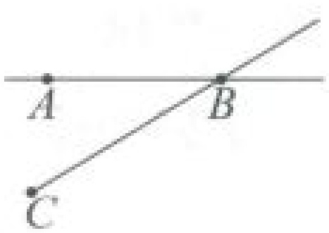
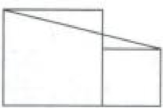
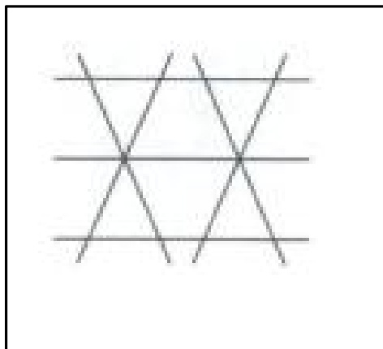
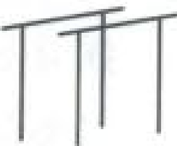
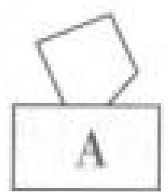
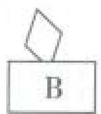
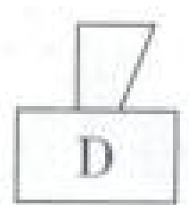
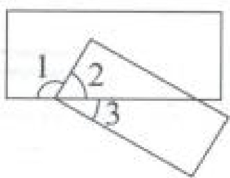

# 人教版 2025-2026 学年小学四年级数学上册期末 《图形与几何》专项测试卷

时间:30 分钟 满分:50+5 分

## 一、 填空题。(每空1分，共13分)

1. 学校组织 “冰雪同梦，亚洲同心” 系列活动，早上 8:00 开始，中午 11:30 结束。钟面上时针从 8:00 到 11:30 旋转了（）度。

2. 下图中有( )条线段、( )条直线、( )条射线。

3. 一根铁丝正好可以围成一个面积为 100 平方厘米的正方形, 这个正方形的边长是 ( ) 厘米, 现将其改围成一个等腰梯形, 上底是 8 厘米, 下底是 18 厘米, 它的一条腰长 ( ) 厘米。

4. 一棵梭梭树发达的根系可以固定 10 平方米的土地，当它们连成片时，就可以阻挡风沙，牵制沙丘的移动，因此，梭梭树也被称为 “沙漠植被之王”。一片荒漠里种了 125 排梭梭树，每排有 40 棵，这些梭梭树最多可以固定（）公顷的土地。

5. 右面两个正方形的边长分别是 5 厘米和 3 厘米，图中共有（）

个梯形，其中最大的梯形的两条底分别是( )厘米和( )厘米，

高是( )厘米。

6. 如图是用木棍扎成的栅栏图样，图中木棍围成了( )个平行四边形，( )个梯形。

## 二、 判断题。(每题 2 分，共 8 分)

1. 一个钝角剪出的两个角一定都是锐角。（）

2. 把一条 10 厘米长的线段向两端各延长 1 米，得到的是一条直线。（）

3. 一个标准篮球场的面积是 420 平方米，25 个这样的篮球场的面积约为 1 公顷。()

4. 用量角器量角，只要确保  $ 0^{\circ} $  刻度线与角的一条边重合就行。（）

## 三、 选择题。(每题 2 分，共 6 分)

1. 学校操场上的双杠如右图所示，两两平行的线段有（）组。

A. 3 B. 5 C. 7 D. 8

2. 被方框( )遮住一部分的图形可能是平行四边形。

3. 如图，如果  $ \angle1=120^{\circ} $  那么  $ \angle3=(\quad) $ 。

A.  $ 120^{\circ} $  B.  $ 60^{\circ} $ 

C.  $ 30^{\circ} $  D.  $ 45^{\circ} $ 

## 四、 操作题。(共 10 分)