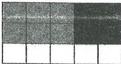
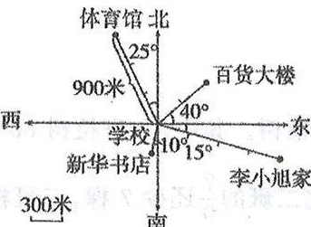
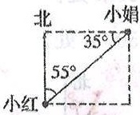

# 六年级上册数学拔尖测试卷人教版

# (月考测试卷一)

关注公众号【桃子麻辣资料库】+微9238562

时间：60分钟 满分：100分

<table border=1 style='margin: auto; width: max-content;'><tr><td style='text-align: center;'>题号</td><td style='text-align: center;'>一</td><td style='text-align: center;'>二</td><td style='text-align: center;'>三</td><td style='text-align: center;'>四</td><td style='text-align: center;'>五</td><td style='text-align: center;'>六</td><td style='text-align: center;'>总分</td></tr><tr><td style='text-align: center;'>得分</td><td style='text-align: center;'></td><td style='text-align: center;'></td><td style='text-align: center;'></td><td style='text-align: center;'></td><td style='text-align: center;'></td><td style='text-align: center;'></td><td style='text-align: center;'></td></tr></table>

## 一、 小小填空，奥秘多。(26分)

1. $\frac{4}{9} + \frac{4}{9} + \frac{4}{9} = (\frac{4}{9}) \times (4) = (\frac{16}{9})$

2. 一个正方形的边长是  $ \frac{1}{5} $  米，它的周长是 ( $ \frac{4}{5} $ ) 米，它的面积是 ( $ \frac{1}{25} $ ) 平方米。

3. 右图用乘法算式表示是 ( $ \frac{2}{3} $ ) × ( $ \frac{2}{5} $ ) = ( $ \frac{4}{15} $ )。

4.  $ \frac{5}{12} $  时 = ( $ \frac{25}{3} $ ) 分  $ \frac{7}{20} $  米 = ( $ \frac{35}{5} $ ) 厘米

 $ \frac{4}{25} $  吨 = ( $ \frac{160}{5} $ ) 千克  $ \frac{2}{5} $  m $ ^{3} $  = ( $ \frac{2400}{5} $ ) dm $ ^{3} $ 

5. 把 7m 长的绳子平均分成 8 段，每段是这根绳子的 ( $ \frac{1}{8} $ )，每段长 ( $ \frac{7}{8} $ ) m。

(填分数)

 $ \frac{7m}{8} $ 

6. 一根铁丝，已经用去  $ \frac{2}{5} $ ，应该把 (铁丝) 看作单位 “1”；等量关系式是：

( ) × ( $ \frac{2}{5} $ ) = ( $ \frac{2}{5} $ ) 用到的。

7. 看一看，填一填。

体育馆在学校的(北)偏(西)(25°)度方向,距离是(900)米;新华书店在学校的(南)偏(西)(10°)度方向,距离是(300)米;李小旭家在学校的(东)偏(南)(15°)度方向,距离是(1200)米;百货大楼在学校的(东)偏(北)(40°)度方向,距离是(600)米。

## 二、 我是数学小法官。(对的打“√”，错的打“×”)(5分)

1.  $ \frac{3}{8} + \frac{5}{8} \times \frac{3}{4} = 1 \times \frac{3}{4} = \frac{3}{4} $ 

2. 一根电线长 5m，用去  $ \frac{2}{5} $  后，还剩下  $ \frac{3}{5}m $ 。

3. 一个数（0 除外）乘以真分数，积一定小于这个数。

4. 有两根 2 米长的铁丝，第一根用去  $ \frac{1}{4} $ ，第二根用去  $ \frac{1}{4} $  米，剩下的一样长。

5. 整数乘法的运算定律与分数乘法的运算定律不同。

## 三、 轻松选择。(将正确答案的序号填在括号里)(5分)

1.“山羊只数是绵羊只数的 $ \frac{1}{2} $ ”，是把(B)看作单位“1”。

A. 山羊只数          B. 绵羊只数          C. 羊的总数

2.一块长方形菜地的长是24m，宽是长的 $ \frac{3}{4} $ ，求面积的算式是( )。

A.  $ 24 \times \frac{3}{4} $ 

B.  $ 24 \times \frac{3}{4} + 24 $ 

C.  $ 24 \times \left(24 \times \frac{3}{4}\right) $ 

3. 把一根绳子分成两段，第一段占全长的  $ \frac{5}{8} $ ，第二段长  $ \frac{5}{8} $  米，两段绳子相比，( )。

A. 第一段长

B. 第二段长

C. 一样长

D. 不确定

4. 如图, 小红看小娟在( A )方向。

A. 北偏东  $ 55^{\circ} $  B. 东偏北  $ 55^{\circ} $  - C. 西偏南  $ 35^{\circ} $ 

5.一种洗衣机先涨价 $ \frac{1}{10} $ ，再降价 $ \frac{1}{10} $ ，现价和原价相比，(A)。 $ \left|x\left(1+\frac{1}{10}\right)\left(1-\frac{1}{10}\right)\right| $ 

A. 便宜了

B. 贵了

C. 价格不变

 $ \frac{11}{10}\times\frac{9}{10}=\frac{99}{100} $ 

## 四、 计算题。(24分)

1. 直接写得数。(4 分)

 $ \frac{5}{9} \times 15 = \frac{25}{3} $ 

 $ \frac{3}{5} \times 2 = \frac{6}{5} $ 

 $ \frac{1}{4} \times \frac{4}{5} = \frac{1}{5} $ 

 $ \frac{1}{9} \times \frac{3}{7} = \frac{1}{21} $ 

 $ \frac{3}{4} \times \frac{1}{5} = \frac{3}{20} $ 

 $ \frac{6}{11} \times \frac{1}{12} = \frac{1}{22} $ 

 $ \frac{3}{22} \times \frac{11}{13} = \frac{3}{26} $ 

 $ 28 \times \frac{7}{24} = \frac{49}{6} $ 